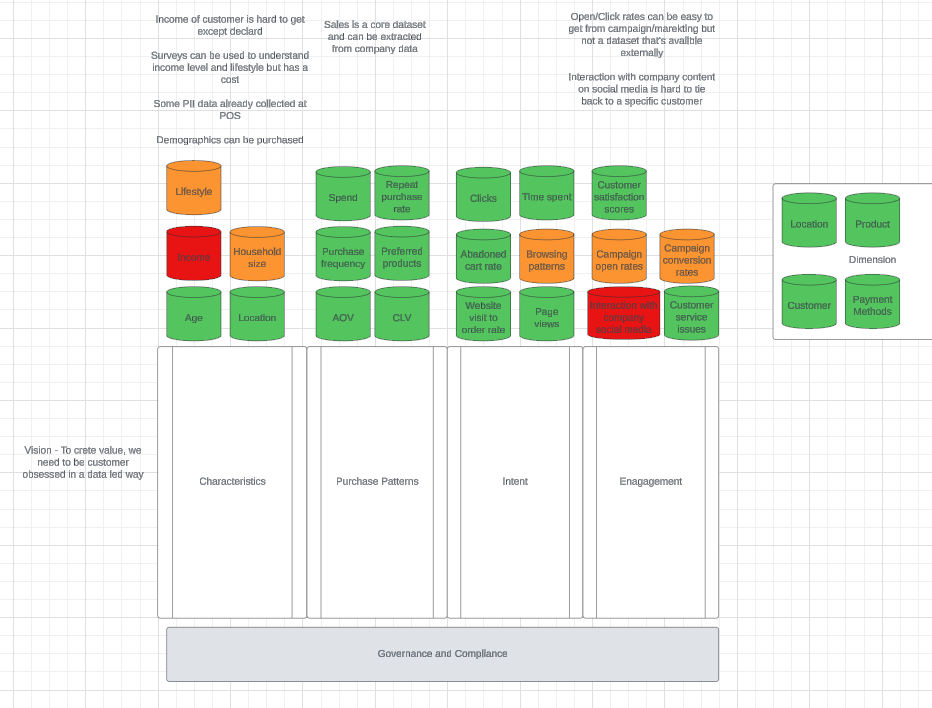

# Project Overview - MonsterMart: A Journey to Customer-Centricity
MonsterMart, a beloved retail chain catering to the unique needs of monsters across US, has been a staple in monster households for decades. Known for its extensive range of everyday monster products, from groceries to electronics, MonsterMart’s stores are strategically located in covert areas and open only after sunset, catering perfectly to its nocturnal clientele.

However, with the rise of a new generation of tech-savvy monsters who crave convenience, MonsterMart expanded into e-commerce. Despite this expansion, MonsterMart has recently observed a troubling downward trend in sales. To combat this and ensure long-term profitability, MonsterMart is embarking on a journey to become more customer-centric, leveraging a composable Customer Data Platform (CDP) to enhance customer insights and personalization.

## The Vision: Building a Composable Customer Data Platform (CDP)

MonsterMart aims to build an in-house composable Customer Data Platform (CDP) to unify customer data from various sources, enabling comprehensive customer analytics and personalized experiences. The CDP will include robust data management features to handle PII, ensuring MonsterMart complies with data privacy regulations such as GDPR and CCPA. 

## Use Cases and Insights

Monster Marts Customer Insights and marketing team aim to answer the following question on their journey to understand their customer better

### Questions
**Who are our customer and  how do they engage with us?** 

By analyzing purchase history and engagement data, MonsterMart can identify customers who haven't made a recent purchase. Targeted re-engagement campaigns, such as personalized discounts or special offers, can be sent to these customers to incentivize them to return and shop again.

Potential Metrics
* Customer Lifetime Value (CLV): Measures the total revenue a customer generates over their relationship with MonsterMart.
* Customer purchase patterns - Average order value, Purchase frequency, 
* Repeat purchase rate
* Conversion Rate: The percentage of customers who make a purchase after engaging with our website
* Customer grouth rate

**What are our customer's intent?**

By understanding not just our customer's purchase patterns but what their intents are, MonsterMart may not only optimize their product offerings but also offer relevant product recommendations, tailored promotions, and customized content leding to increased customer satisfaction and loyalty

Potential Metrics
* Page Views: Number and frequency of page views can indicate interest in specific products or categories.
* Add-to-Cart Rate: Percentage of customers who add items to their shopping cart, indicating a strong purchase intent.
* Abandoned Cart Rate: Percentage of customers who add items to their cart but do not complete the purchase, signaling potential barriers or reconsideration.
* Bounce Rate: Percentage of visitors who leave the site after viewing only one page, which can suggest a lack of relevance or interest.

## Conceptual Data Model

## Implementation (Initial & Future)
1. Data Ingestion Framework - To collect and integrate data from various sources, including in-store transactions, e-commerce activities, customer service interactions
2. Data Integration and Unification - To create a single, unified view of each customer by integrating data from various touchpoints.
3. Data Privacy and Compliance - To ensure compliance with data privacy regulations and protect customer Personally Identifiable Information (PII).
    * PII Management: Implement robust PII management processes.
    * Compliance Automation: Use tools to automate compliance workflows, ensuring that PII delete requests can be fulfilled within hours.
4. Analytics and Insights - To derive actionable insights from the unified customer data to enable strategic decisions.
